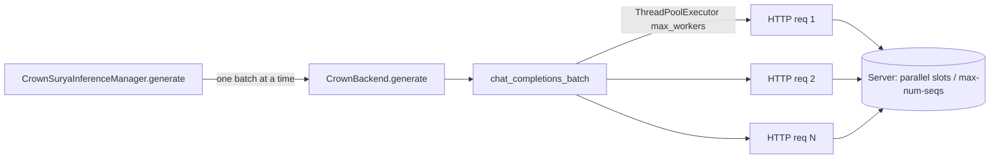

# Improve batch-processing parallelism (crown-only, no surya edits)

## Hard constraint

`surya` must remain an unmodified pip dependency. **All changes live in `crown/`** via subclassing/overriding. crown already owns:
- [`CrownLlamaCppBackend`](crown/inference.py:173) / [`CrownVllmBackend`](crown/inference.py:44) — full `start()`/`generate()` overrides.
- [`crown/openai_client.py`](crown/openai_client.py) — crown's own copy of `chat_completions_batch`.
- [`CrownSuryaInferenceManager`](crown/inference.py:224) — the singleton wired into [`surya_api.py`](surya_api.py:257).

So nothing in `surya/` is touched.

## Context

Batch inference has two parallelism layers:

1. **Server-side** — llama.cpp `--parallel N` decode slots + prompt-processing tuning (`-b`/`-ub`/`-t`/`--flash-attn`/NUMA); vllm `--max-num-seqs` (continuous-batching capacity) from [`_gpu_settings()`](surya/inference/backends/vllm.py:51).
2. **Client-side** — [`chat_completions_batch()`](crown/openai_client.py:156) fans items across a `ThreadPoolExecutor(max_workers=...)`; each worker issues one blocking HTTP `POST /v1/chat/completions`.



## Problems found

### P1 — vllm client concurrency under-saturated
[`CrownVllmBackend.generate()`](crown/inference.py:160) passes `max_workers=settings.SURYA_INFERENCE_PARALLEL` (default **8**), but the vllm server is spawned with `--max-num-seqs` = **32** on a 24GB card ([`_gpu_settings()`](surya/inference/backends/vllm.py:51)). Only 8 of 32 continuous-batching slots are ever filled — ~4× under-utilization. Continuous batching only helps if the HTTP queue keeps the server full.

### P2 — client/server concurrency hard-coupled
Both crown backends derive client `max_workers` from `SURYA_INFERENCE_PARALLEL`. Server slots cost KV-cache memory; client workers just keep the queue full. These are different concerns and should be decoupled.

### P3 — llama.cpp prompt-processing untuned (experiment branch, untested)
The experiment branch's `spawn_fn` adds tuning flags that improve prompt-processing (vision prefill is heavy) and CPU scheduling, but several are hardware-conditional and unsafe to enable blindly:
- `--flash-attn on` — big win on supported GPUs; commented out (untested).
- `-b 4096` / `-ub 4096` — larger prompt batch; helps vision prefill.
- `-t cpu_count//2` — CPU threads for non-offloaded parts.
- `--no-mmap` / `--direct-io` — faster model load, higher RAM use.
- `--numa isolate` / `--cpu-range` / `--cpu-strict 1` — NUMA pinning; hurts on non-NUMA single-socket boxes.

## Plan (all in `crown/`)

### Step 1 — New `crown/settings.py`

crown can't edit [`surya/settings.py`](surya/settings.py), so add a crown-owned settings module. A pydantic `BaseSettings` reading the same `local.env` / env vars, exposing only the new knobs (inherited knobs still come from `suryya.settings.settings`):

```python
# crown/settings.py
from typing import Optional
from pydantic_settings import BaseSettings

class CrownSettings(BaseSettings):
    # Decoupled client concurrency for chat_completions_batch. None =
    # backend-specific default:
    #   llamacpp -> surya SURYA_INFERENCE_PARALLEL
    #   vllm    -> the server's max_num_seqs (saturate continuous batching)
    SURYA_INFERENCE_MAX_WORKERS: Optional[int] = None

    # llama.cpp prompt-processing / CPU tuning. Safe defaults; enable per-host.
    LLAMA_CPP_BATCH: int = 4096
    LLAMA_CPP_UBATCH: int = 4096
    LLAMA_CPP_THREADS: Optional[int] = None  # None = max(1, cpu_count//2)
    LLAMA_CPP_FLASH_ATTN: bool = True
    LLAMA_CPP_NO_MMAP: bool = False
    LLAMA_CPP_DIRECT_IO: bool = False
    LLAMA_CPP_NUMA: Optional[str] = None  # distribute|isolate|numactl; None=off
    LLAMA_CPP_CPU_RANGE: Optional[str] = None  # e.g. "0-15"; None=off
    LLAMA_CPP_CPU_STRICT: bool = False

    class Config:
        env_file = ".env"
        extra = "ignore"

crown_settings = CrownSettings()
```

### Step 2 — [`CrownLlamaCppBackend.start()`](crown/inference.py:178)

Currently it just calls `super().start()`. Replace with a **full override** (mirroring [`CrownVllmBackend.start()`](crown/inference.py:52)'s pattern) that builds its own `spawn_fn` applying the experiment-branch flags gated by `crown_settings`, with safe defaults. Keep `--parallel`/`--ctx-size` scaling logic from the parent (re-implement inline since we can't call the parent's private `spawn_fn`). Enable `--flash-attn on` by default; emit NUMA/CPU-pinning only when explicitly set.

### Step 3 — [`CrownVllmBackend.start()`](crown/inference.py:52)

Already a full override. Add: store the computed `max_num_seqs` on `self._max_num_seqs` so `generate()` can use it as the client-concurrency default.

### Step 4 — Decouple client concurrency in `generate()`

- [`CrownLlamaCppBackend.generate()`](crown/inference.py:184): `max_workers = crown_settings.SURYA_INFERENCE_MAX_WORKERS or settings.SURYA_INFERENCE_PARALLEL`.
- [`CrownVllmBackend.generate()`](crown/inference.py:160): `max_workers = crown_settings.SURYA_INFERENCE_MAX_WORKERS or self._max_num_seqs`. Fixes P1.

### Step 5 — (Optional) streaming in [`crown/openai_client.py`](crown/openai_client.py)

Add a `stream=True` path in `chat_completions_batch` so a request releases its server slot the instant the final token arrives. Lower priority; only if benchmarks show head-of-line blocking.

### Step 6 — Docs

Comment the new crown settings with tuning guidance (when to enable NUMA, when `--no-mmap` helps, how `SURYA_INFERENCE_MAX_WORKERS` relates to server capacity).

## Files touched (crown only)

- **NEW** [`crown/settings.py`](crown/settings.py) — crown-owned settings for new knobs.
- [`crown/inference.py`](crown/inference.py) — full `CrownLlamaCppBackend.start()` override with tuned `spawn_fn`; store `_max_num_seqs` in `CrownVllmBackend.start()`; decoupled `max_workers` in both `generate()` overrides.
- (optional) [`crown/openai_client.py`](crown/openai_client.py) — streaming path.

No `surya/` files are modified.

## Risks / notes

- `--flash-attn on` errors at startup on builds lacking FA kernels — already surfaced by the health-check + log capture in [`attach_or_spawn()`](surya/inference/backends/spawn.py:172).
- NUMA/CPU pinning default **off**; enabling on single-socket boxes can reduce throughput.
- `--no-mmap` increases resident RAM by the model size; default off.
- vllm `max_workers = max_num_seqs` assumes a dedicated server; on a shared external server (`SURYA_INFERENCE_URL`), set `SURYA_INFERENCE_MAX_WORKERS` explicitly.
- crown settings reading a separate env file (`.env`) vs surya's `local.env`: align the `env_file` to whatever the project already uses, or read both, to avoid surprising the user. Confirm the env-file convention before implementing.